# MMM (MyMovieMemo)

 가장 개인적인 것이 가장 창의적인 것이다 - Martin Scorsese

 "나만의 작은 영화 일기장"

<br/>

## 📌 목차

1. [개요](#-개요)

2. [팀](#-팀)
   
3. [프로젝트 소개](#-프로젝트-소개)
  
    1. [서비스 기획 목표](#서비스-기획-목표)
   
    2. [ERD](#ERD)
   
    3. [WireFrame](#WireFrame)

    4. [영화 추천 알고리즘](#영화-추천-알고리즘)

    5. [구현 기능](#구현-기능)
   
4. [설치 및 실행](#-설치-및-실행)
   
5. [오픈소스 출처](#-오픈소스-출처)
   
6. [느낀점](#-느낀점)

<br/>

## 🌟 개요

### 프로젝트 기간

2024.11.18 ~ 2024.11.26 (9일)

### 기술 스택 

  
  
  
  
  

## 🧑🏻‍🤝‍🧑🏻 팀

|       |  Github  |  역할  |
|:------------:|:------------:|:------------:|
| **김재준** |  [zooniezi](https://github.com/zooniezi)  |  Backend  |
| **박태형**  |  [taeng98](https://github.com/minu-j/)  |  Frontend  |

<br/>

## 📽️ 프로젝트 소개
  
### 프로젝트 목표


**MMM (My Movie Memo)** 는 사용자의 영화 감상 경험을 바탕으로 **언제**, **누구와**, **어떤 장르**의 영화를 감상하면 가장 만족스러운 경험을 얻을 수 있는지 추천하는 서비스입니다.

- 영화 리뷰를 중심으로 한 유저 커뮤니티 제공

- 팔로우한 유저들이 감상한 영화를 확인할 수 있는 피드 기능 제공

- 영화 감상 경험 자체에 초점을 둔 도전 과제를 통해 영화 감상 동기 부여


### ERD

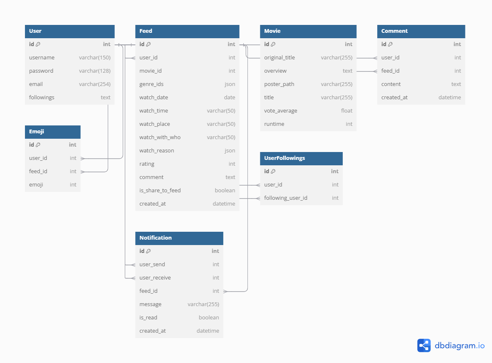

ARGOS의 데이터베이스 모델링은 크게 유저와 영화 정보로 구분됩니다.

- 유저는 영화와 score 정보를 가진 N:M 관계로 연결되며, 각 유저와도 팔로잉/팔로워 관계를 위해 N:M 관계로 연결됩니다.

- 영화는 각 장르, 배우, 감독, 키워드, 예고편 영상 주소, 공급사(OTT서비스)의 6가지 요소와 N:M 관계를 가집니다.


### Component Diagram

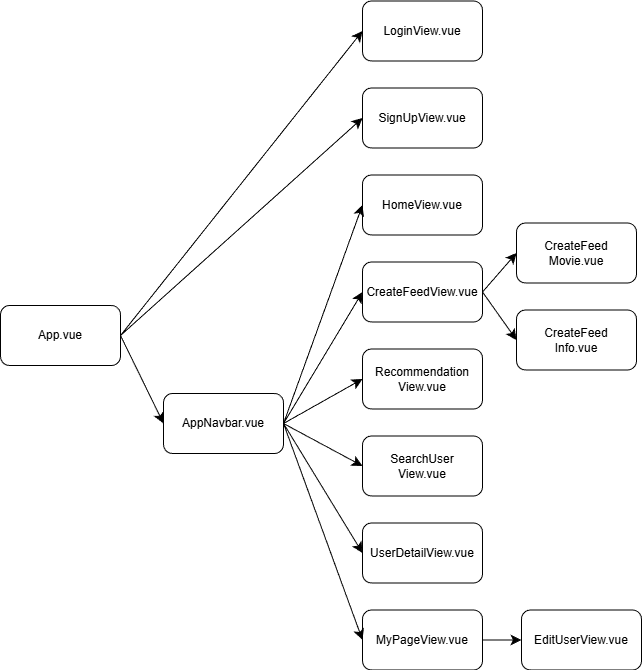

### 추천 데이터 전처리

- MovieLens 데이터셋 활용

  [MovieLens link](https://grouplens.org/datasets/movielens/)

- 원본 데이터 확인

  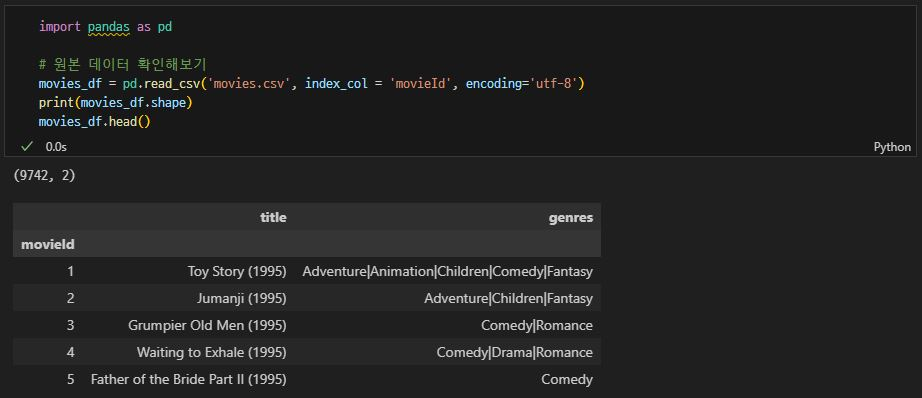
  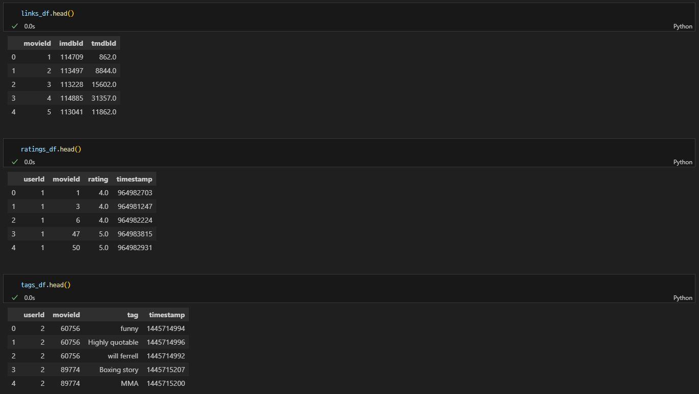

- 데이터의 movieId를 tmdbId로 수정
  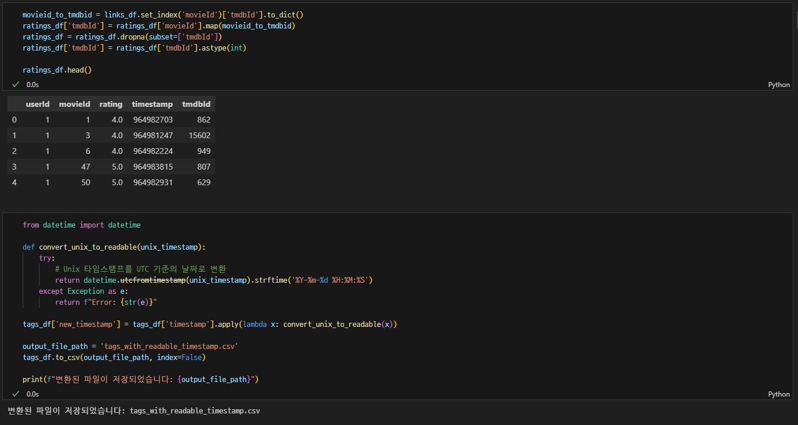

- 장르 데이터 맵핑 및 추가하기
  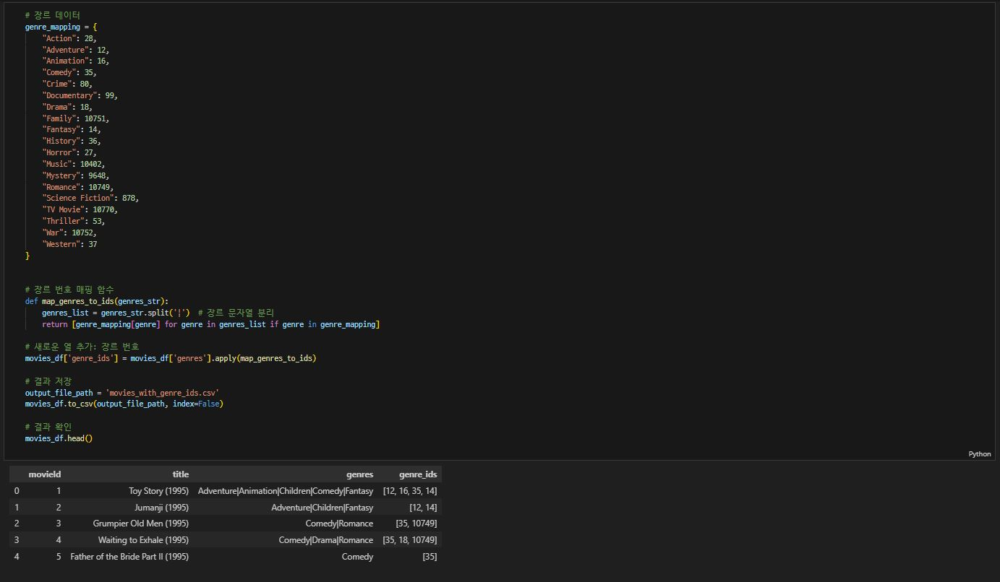

- TMDB API 요청으로 MovieLens 데이터 내 영화에 대응되는 자료 수집
  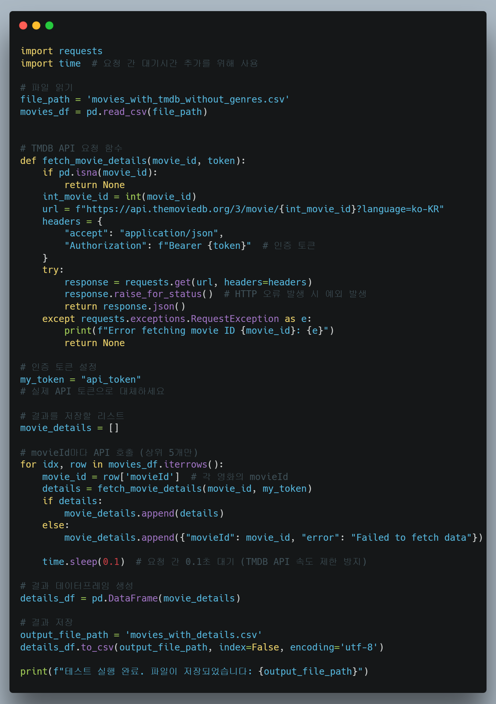

- 수집 자료 확인
  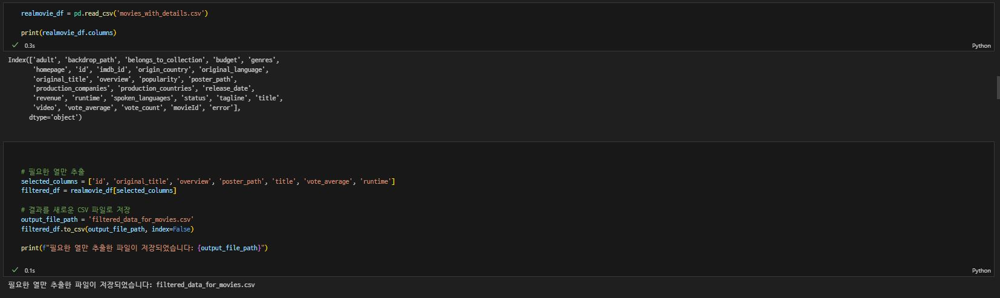

- MMM의 데이터에 맞는 watch_time, watch_place, watch_with_who 등 추가
  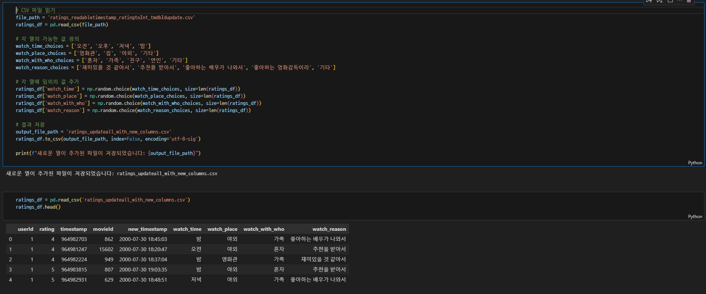

- Chat GPT를 이용해 평점 별 영화 Comment 데이터 생성 및 추가
  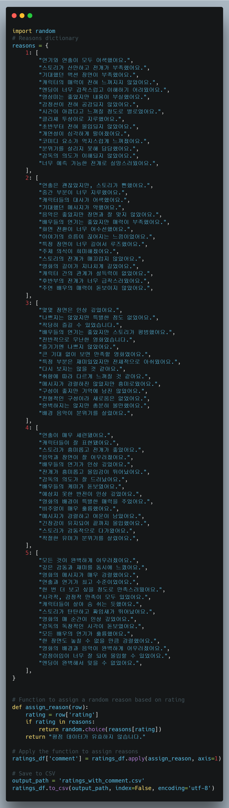

- 데이터 형태에 맞게 형식 변경하고 저장
  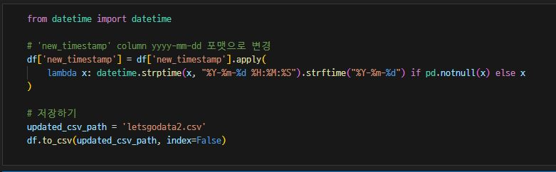

### 영화 추천 알고리즘


- MMM에서의 영화 평가는 최저 1점에서 최고 5점으로 평가되고, 각 평가는 언제, 누구와, 어디서 보았는지에 대한 경험 정보가 포함됩니다.

- 유저는 영화를 1점에서 5점로 영화를 평가 하고, MMM은 영화의 장르 정보와 유저가 기록한 경험 데이터를 함께 저장합니다.

- MMM의 데이터베이스에는 유저들이 작성한 피드가 유저 정보와 N:M관계로 연결되어 저장되어있습니다.

- MMM의 추천 알고리즘은 movies app 내의 views.py 에서 작동합니다. 

- 사용자의 영화 추천을 GET요청받으면, 사용자가 입력한 조건에 정확히 맞는 피드들과, 어느정도 유사함을 갖춘 피드들을 수집해옵니다.
  
  ```python
  def recommend_movies_upgrade(request):
      user_id = request.GET.get('user_id')  # 사용자 ID
      watch_time = request.GET.get('watch_time')  # 예: '오전'
      watch_with_who = request.GET.get('watch_with_who')  # 예: '친구'
      genre_ids_temp = request.GET.getlist('genre_id')  # 예: 12
      genre_ids = int(genre_ids_temp[0])
      selected_rating = request.GET.get('selected_rating') # 영화 추천 범주 설정용 변수

      similar_feeds = get_similar_feeds(watch_time, watch_with_who, genre_ids, user_id)
      matched_feeds = get_matched_feeds(watch_time, watch_with_who, genre_ids, user_id)
  ```

- 이후 입력 조건과 일치하는 데이터를 추천 후보 딕셔너리에 모두 저장하고, 만약 데이터가 부족하다면 유사한 데이터들 또한 추가합니다. 

  ```python
    # 중복된 영화는 제외하고 추천
    recommended_movies = {}
    for feed in matched_feeds:
        if feed.movie_id not in recommended_movies:
            recommended_movies[feed.movie_id] = {
                "movie_id": feed.movie_id,
                "genres": feed.genre_ids,
                "rating": feed.rating,
                "comment": feed.comment,
            }
    if len(recommended_movies) <= 10:   
        for feed in similar_feeds:
            if feed.movie_id not in recommended_movies:
                recommended_movies[feed.movie_id] = {
                    "movie_id": feed.movie_id,
                    "genres": feed.genre_ids,
                    "rating": feed.rating,
                    "comment": feed.comment,
                }
    # 높은 평점 순으로 정렬된 추천 리스트 반환
    recommend_movies_candidate = sorted(recommended_movies.values(), key=lambda x: x["rating"], reverse=True)
  ```
  
- 입력받은 추천 다양성 데이터를 기반으로 어떤 평점의 데이터까지 추천에 고려할 것인지 결정합니다.

  ``` python
    # rating별 인덱스 범위를 계산
    from collections import defaultdict

    def get_rating_ranges(data):
        rating_ranges = defaultdict(list)
        for index, item in enumerate(data):
            rating = item['rating']
            rating_ranges[rating].append(index)

        # 각 rating의 첫 번째와 마지막 인덱스 계산
        result = {5:(-1,-1),4:(-1,-1),3:(-1,-1),2:(-1,-1),1:(-1,-1)}
        for rating, indices in rating_ranges.items():
            result[rating] = (min(indices), max(indices))

        return result
  ```
- 최종 추천 후보 리스트에서 5개의 영화를 추천합니다.
  ```python
    # 실행
    rating_ranges = get_rating_ranges(recommend_movies_candidate)
    print(rating_ranges)

    can_recommend_index = rating_ranges[int(selected_rating)][1]
    
    if can_recommend_index >= 5:
        sample_recommend_movies = random.sample(recommend_movies_candidate[:can_recommend_index+1],5)
    else:
        sample_recommend_movies = recommend_movies_candidate

    # 추천 목록에 해당하는 영화 데이터 가져오기
    movie_ids = [rec['movie_id'] for rec in sample_recommend_movies]

    if movie_ids:
        movies = Movie.objects.filter(id__in=movie_ids)
    else:
        movies = [] 

    data = []
    data = [
    {
        "id": movie.id,
        "original_title": movie.original_title,
        "overview": movie.overview,
        "poster_path": movie.poster_path,
        "title": movie.title,
        "vote_average": movie.vote_average,
    }
    for movie in movies
    ]
    random.shuffle(data)
    return JsonResponse(data, safe=False)
  ```

### 구현 기능

#### ✅ 로그인 기준 페이지 접근 제한

  - **관련 이미지**

    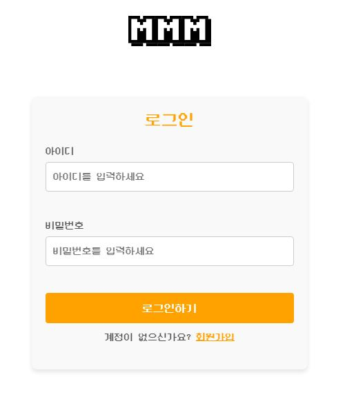

  - **로그인 여부에 따라 접근 가능한 페이지를 제한**

    - 로그인하지 않은 사용자는 로그인과 회원가입 페이지만 접근할 수 있습니다.

      - 이를 위해 `publicPages` 배열에 로그인과 회원가입 페이지를 정의하였으며, 해당 페이지가 아닌 경우 인증이 필요한 페이지로 간주합니다.

    ```javascript
    const publicPages = ['logIn', 'signUp']
    const authRequired = !publicPages.includes(to.name)
    if (authRequired && !isAuthenticated) {
      return next({ name: 'logIn' })
    }

    ```

    - 로그인 상태인 사용자가 로그인 또는 회원가입 페이지에 접근하려고 할 경우, 홈 화면으로 리다이렉트됩니다.

    ```javascript
    if ((to.name === 'logIn' || to.name === 'signUp') && isAuthenticated) {
      return next({ name: 'home' })
    }
    ```

  - **보안과 UX를 모두 고려한 페이지 접근 제어**

    - 로그인하지 않은 사용자의 인증이 필요한 페이지 접근을 방지하며, 비정상적인 경로로 접근하려는 시도를 안전하게 처리합니다.

    - 로그인 상태를 실시간으로 확인하여 사용자의 접근 흐름을 자연스럽게 유도합니다.

#### ✅ 사용자 영화 기록 표시

  - **관련 이미지**

    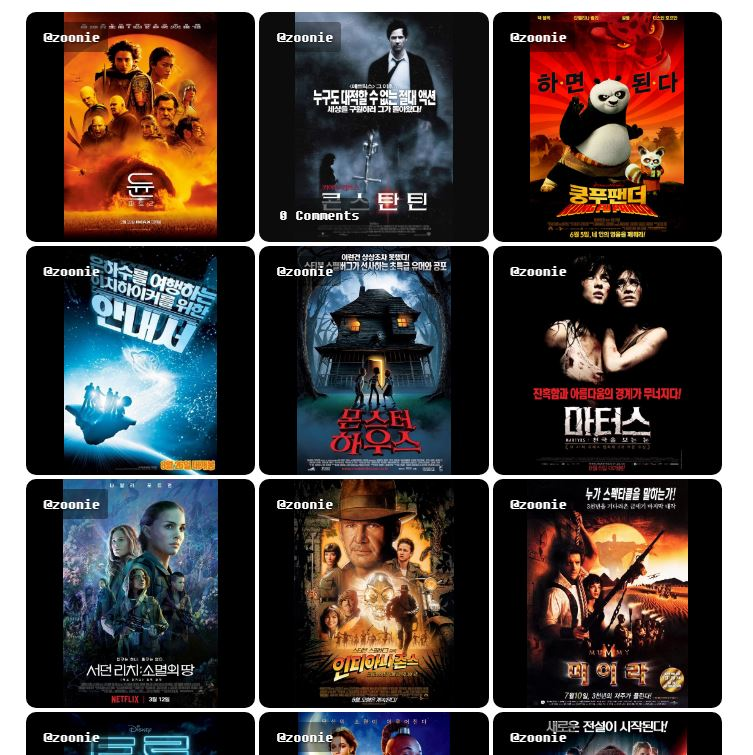

  - **팔로워와 사용자 영화 기록 표시 기능**

    - **팔로워의 영화 기록 표시**: 팔로워의 공유된 영화 기록을 불러와 각 기록에 대한 댓글 수를 동기화합니다.

      - API 요청을 통해 팔로워들의 영화 피드 데이터를 가져옵니다.

      - 댓글 개수를 실시간으로 업데이트하여 사용자와의 소통 정보를 제공합니다.

    ```javascript
    const response = await axios.get(`${store.SERVER_API_URL}/movies/feeds/followed/`, {
      headers: { Authorization: `Token ${store.serverToken}` },
    });
    feedData.value = response.data.map((feed) => ({
      ...feed,
      comments_count: null,
    }));

    ```

  - **로그인한 사용자의 영화 기록 표시**: 사용자가 남긴 영화 기록 데이터를 불러와 동일한 방식으로 처리합니다.

    - API 호출로 사용자 고유의 영화 기록 데이터를 수집하며, 영화 포스터와 댓글 수를 함께 표시합니다.

    ```javascript
    const response = await axios.get(`${SERVER_API_URL}/movies/feeds/${store.userId}/`, {
      headers: { Authorization: `Token ${store.serverToken}` },
    });
    feeds.value = response.data.map((feed) => ({
      ...feed,
      comments_count: null,
    }));
    
    ```

#### ✅ 영화 기록 이모지/댓글 시스템

  - **관련 이미지**

    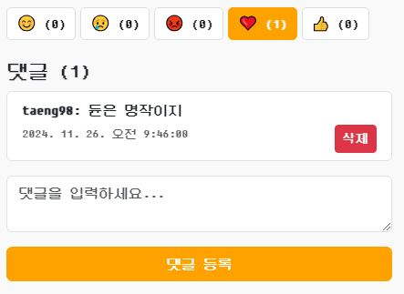

  - **댓글 시스템**

    - **댓글 가져오기**: 영화 기록에 등록된 모든 댓글을 서버에서 불러와 표시하며, 댓글 개수를 실시간으로 업데이트합니다.

    ```javascript
    const fetchComments = async (feedId) => {
      const response = await axios.get(
        `${store.SERVER_API_URL}/movies/feeds/${feedId}/comments/`,
        { headers: { Authorization: `Token ${store.serverToken}` } }
      );
      comments.value = response.data;
      commentCount.value = response.data.length;
      updateFeedCommentCount(feedId, commentCount.value);
    };
    
    ```

    - **댓글 등록**: 새로운 댓글을 서버에 등록하고 실시간으로 UI에 반영합니다.

    ```javascript
    const postComment = async () => {
      const response = await axios.post(
        `${store.SERVER_API_URL}/movies/feeds/${selectedFeed.value.id}/comments/`,
        { content: newComment.value },
        { headers: { Authorization: `Token ${store.serverToken}` } }
      );
      comments.value.push(response.data);
      newComment.value = "";
      commentCount.value++;
      updateFeedCommentCount(selectedFeed.value.id, commentCount.value);
    };

    ```

    - **댓글 삭제**: 기존 댓글을 서버에서 삭제하고 UI에서 즉시 제거합니다.

    ```javascript
    const deleteComment = async (commentId) => {
      await axios.delete(
        `${store.SERVER_API_URL}/movies/feeds/${selectedFeed.value.id}/comments/${commentId}/`,
        { headers: { Authorization: `Token ${store.serverToken}` } }
      );
      comments.value = comments.value.filter((comment) => comment.id !== commentId);
      commentCount.value--;
      updateFeedCommentCount(selectedFeed.value.id, commentCount.value);
    };
    
    ```

  - **이모지 시스템**

    - **감정 표현 추가/삭제**: 사용자 감정 표현(이모지)을 추가하거나, 동일한 이모지를 다시 선택하면 삭제하는 기능을 제공합니다.

    ```javascript
    const toggleEmoji = async (emoji) => {
      if (selectedEmoji.value === emoji) {
        await axios.delete(`${store.SERVER_API_URL}/movies/feeds/${selectedFeed.value.id}/emoji/`, {
          headers: { Authorization: `Token ${store.serverToken}` },
        });
        selectedEmoji.value = null;
        emojiCounts.value[emoji] = (emojiCounts.value[emoji] || 1) - 1;
      } else {
        const response = await axios.post(
          `${store.SERVER_API_URL}/movies/feeds/${selectedFeed.value.id}/emoji/`,
          { emoji },
          { headers: { Authorization: `Token ${store.serverToken}`, "Content-Type": "application/json" } }
        );
        selectedEmoji.value = response.data.emoji;
        emojiCounts.value[emoji] = (emojiCounts.value[emoji] || 0) + 1;
      }
    };

    ```

    - **이모지 데이터 동기화**: 영화 기록별 이모지 개수와 사용자의 선택 상태를 서버와 동기화하여 정확한 정보를 제공합니다.

    ```javascript
    const openModal = async (feed) => {
      const response = await axios.get(`${store.SERVER_API_URL}/movies/feeds/${feed.id}/emoji/list/`, {
        headers: { Authorization: `Token ${store.serverToken}` },
      });
      response.data.forEach((emoji) => {
        emojiCounts.value[emoji.emoji] = (emojiCounts.value[emoji.emoji] || 0) + 1;
      });
      const userEmoji = response.data.find((e) => e.user === store.userName);
      selectedEmoji.value = userEmoji ? userEmoji.emoji : null;
    };

    ```

  - **UI 구성 요소**

    - **댓글 및 이모지 표시**: 댓글은 작성 시간순으로 정렬되어 표시되며, 각 댓글은 삭제 버튼을 통해 관리됩니다.

    - **이모지 선택**: 사용자는 다양한 이모지(😊, 😢, 😡, ❤️, 👍)를 클릭하여 감정을 표현할 수 있으며, 선택된 이모지는 강조 표시됩니다...

#### ✅ 영화 검색 및 기록 생성

  - **관련 이미지**

    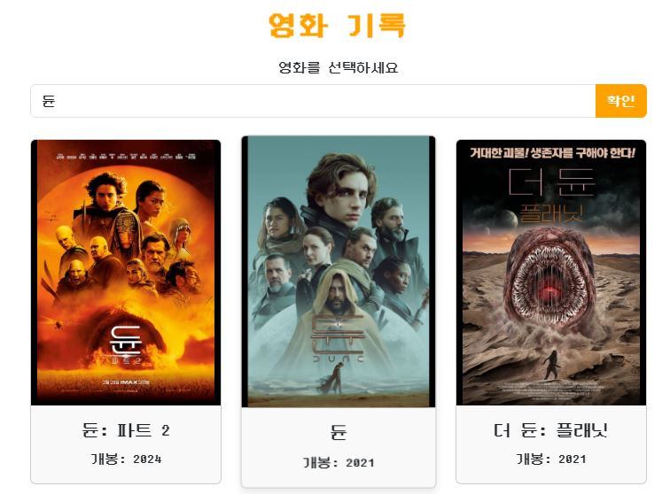

    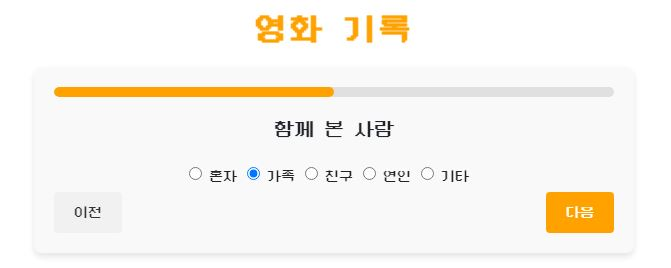

  - **영화 검색**

    - **사용자 입력에 기반한 검색**: 사용자가 입력한 검색어를 TMDB API에 전달하여 영화 목록을 가져옵니다.

      - 검색어가 입력되지 않았을 경우, 알림 메시지가 표시됩니다.

    ```javascript
    if (!searchQuery.value.trim()) {
      alert('검색어를 입력해주세요.');
      return;
    }

    ```

    - **TMDB API 요청**: 검색 결과를 실시간으로 가져오며, 결과는 영화 제목, 줄거리, 포스터 등으로 구성됩니다.

    ```javascript
    const response = await axios.get(`${BASE_URL}/search/movie`, {
      headers: { Authorization: `Bearer ${TMDB_TOKEN}` },
      params: { query: searchQuery.value.trim(), language: 'ko-KR' },
    });
    movies.value = response.data.results;

    ```

  - **영화 기록 생성**

    - **영화 데이터 추가**: 검색된 영화 정보를 로컬 데이터베이스에 추가합니다.

      - 영화의 ID, 제목, 줄거리, 포스터 경로, 상영 시간 등을 포함한 데이터를 서버에 전달합니다.

    ```javascript
    const payload = {
      id: rawMovie.id,
      original_title: rawMovie.original_title,
      overview: rawMovie.overview,
      title: rawMovie.title,
      vote_average: rawMovie.vote_average,
      poster_path: rawMovie.poster_path,
      runtime: rawMovie.runtime,
    };
    axios.post(`${store.SERVER_API_URL}/movies/movie/create/`, payload, {
      headers: {
        Authorization: `Token ${store.serverToken}`,
        'Content-Type': 'application/json',
      },
    });

    ```

    - **피드 추가**: 사용자가 영화에 대한 개인 기록을 작성하고 이를 피드에 공유합니다.

      - 기록은 관람 장소, 관람 이유, 평점, 코멘트 등 사용자 정의 데이터를 포함합니다.

    ```javascript
    const payload = {
      user: userId.value,
      movie_id: movieId,
      genre_ids: genreIds,
      watch_date: watchDate.value,
      watch_time: watchTime.value,
      watch_place: watchPlace.value,
      watch_with_who: watchWithWho.value,
      watch_reason: rawWatchReason,
      rating: rating.value,
      comment: comment.value,
      is_share_to_feed: isShareToFeed.value,
    };
    axios.post(`${store.SERVER_API_URL}/movies/feed/create/`, payload, {
      headers: {
        Authorization: `Token ${store.serverToken}`,
        'Content-Type': 'application/json',
      },
    });

    ```

  - **기능 흐름**

    - **검색 → 영화 추가 → 피드 생성**: 사용자는 검색 결과에서 선택한 영화에 대해 기록을 추가하고, 이를 피드에 공유할 수 있습니다.

    - 영화가 이미 데이터베이스에 존재하지 않을 경우, 추가 작업이 자동으로 수행됩니다.

#### ✅ 사용자 검색 및 팔로우

  - **관련 이미지**

    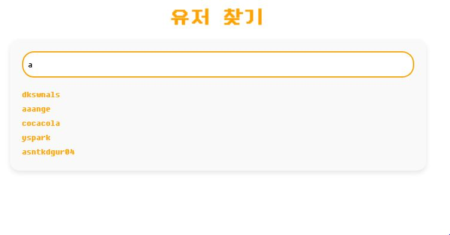

    

    

  - **사용자 검색**

    - **사용자 목록 가져오기**: 서버에서 활성 사용자 데이터를 가져오며, 관리자 계정을 제외합니다.

    ```javascript
    const response = await axios.get(`${store.SERVER_API_URL}/accounts/allusers/without_admin/`);
    users.value = response.data;
    filterUsers(); // 초기 필터링

    ```

    - **검색 필터링**: 입력된 검색어를 기준으로 활성 사용자만 필터링하여 표시합니다.

      - 본인 계정은 검색 결과에서 제외됩니다.

    ```javascript
    filteredUsers.value = users.value.filter(user =>
      user.is_active &&
      user.id !== store.userId &&
      user.username.toLowerCase().includes(searchQuery.value.toLowerCase())
    );

    ```
  
  - **팔로우 기능**

    - **팔로우 상태 확인**: 특정 사용자의 팔로우 여부를 서버에서 확인합니다.

    ```javascript
    const response = await axios.get(`${store.SERVER_API_URL}/accounts/follow/${userName}/`, {
      headers: { Authorization: `Token ${store.serverToken}` },
    });
    isFollowing.value = response.data.isFollowed;

    ```

    - **팔로우/언팔로우 토글**: 사용자 클릭으로 팔로우/언팔로우를 전환하고, 팔로워 수를 실시간으로 업데이트합니다.

    ```javascript
    const response = await axios.get(`${store.SERVER_API_URL}/accounts/follow/${userName}/`, {
      headers: { Authorization: `Token ${store.serverToken}` },
    });
    isFollowing.value = response.data.isFollowed;

    ```

  - **팔로우/팔로잉 정보**

    - **팔로워/팔로잉 수 데이터 가져오기**: 사용자의 팔로워와 팔로잉 수를 서버에서 받아와 UI에 표시합니다.

    ```javascript
    const response = await axios.get(`${store.SERVER_API_URL}/accounts/follow/list/${userName}/`, {
      headers: { Authorization: `Token ${store.serverToken}` },
    });
    followerCount.value = response.data.follower_count;
    followingCount.value = response.data.following_count;

    ```

<br/>

## 🚀 설치 및 실행

1. Git Clone

```shell
$ git clone https://github.com/zooniezi/MMM.git
```

2. Run Back-server
```shell
$ cd final-pjt-back

$ python -m venv venv
$ source venv/Scripts/activate

$ python manage.py migrate

$ python manage.py db_movie_lens.json

$ python manage.py runserver
```

3. Run Front-Server
```shell
$ cd final-pjt-front/

$ npm install

$ npm run dev
```

4. Done!

<br/>

## 느낀점

### 김재준

나는 아직 부족했다. 프로젝트를 제대로 해낼 수 있을까 하는 의문도 들었다.
개발 초기부터 명확한 계획을 세우는 것의 중요성을 절실히 깨달았다. 코드가 늘어나고 기능이 복잡해질수록, 내가 무엇을 만들고자 하는지 분명히 이해하는 것이 정말 중요했다.

이번 프로젝트에서 백엔드 부분을 맡으며 부족함을 많이 느꼈고, 남은 한 해 동안 SSAFY에서 배운 내용을 복습하며 내 것으로 만드는 데 집중하겠다고 다짐했다.

결과물이 부족하게 느껴질 수도 있겠지만, 기능 구현부터 프로젝트 마무리까지 태형 님과 함께 고민하고 논의했던 일주일은 매우 값진 경험이었다. 첫 프로젝트를 성공적으로 마무리한 태형 님께 진심으로 감사드리며, 고생 많으셨다는 격려의 말씀도 전하고 싶다.

이 프로젝트가 내가 더 성장하고 발전하는 중요한 초석이 되기를 바란다.

### 박태형

실전에 앞서 수많은 연습이 중요하다는 것을 느꼈다. SSAFY에서 배운 내용을 프로젝트라는 실전에서 적재적소로 적용하는게 매우 힘들었다. 내용을 이해하는 것을 넘어서 연습이 부족함을 크게 느꼈다.

특히, 컴포넌트 구조를 잘 구성하는 것이 중요함을 느꼈다. 아무래도, 프로젝트의 프론트엔드 부분을 처음 맡아보며 컴포넌트 구조를 초기에 명확히 설계하고 코드를 진행하지 못했다. 이러한 점에서, 코드 재사용성이 떨어져 작업 효율성이 매우 떨어지는 느낌이었다.

또한, 백엔드와 프론트엔드를 철저히 구분하며 진행했는 데, 재준 님과 기획부터 설계, 구현까지 모든 과정에서 소통하며 협업의 의미를 키우며, 즐겁게 프로젝트를 진행할 수 있었다. 혼자서는 해내지 못했을 것이라 생각하며, 끝까지 열심히 프로젝트를 진행해준 재준 님께 진심 어린 감사의 말씀드리고 싶다.

프로젝트를 진행하면서 어떤 점이 부족한 지 크게 배울 수 있었다. 매우 귀중한 프로젝트였다. 이 프로젝트를 발판 삼아서 더 나은 역량을 갖출 수 있도록 고민해야겠다.